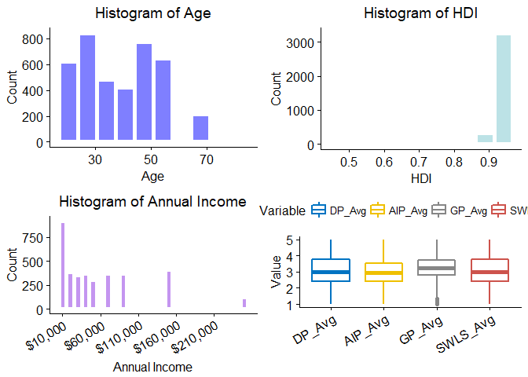
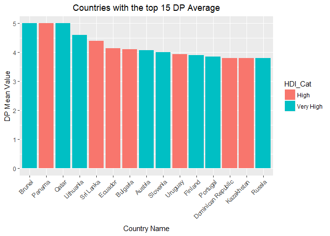
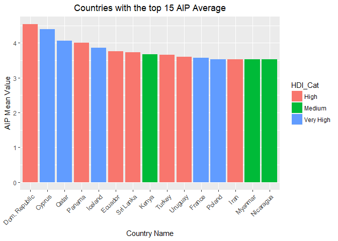
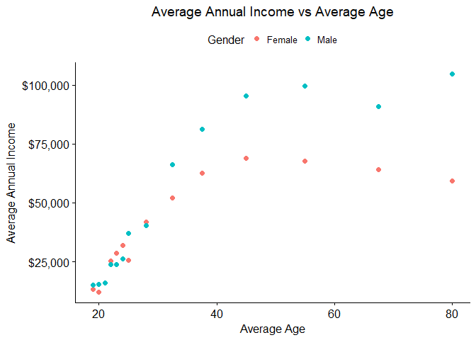
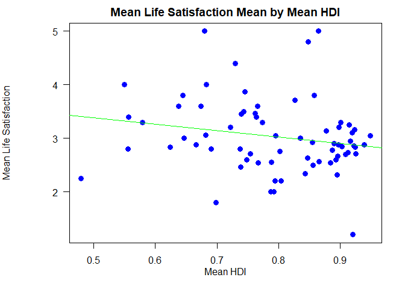
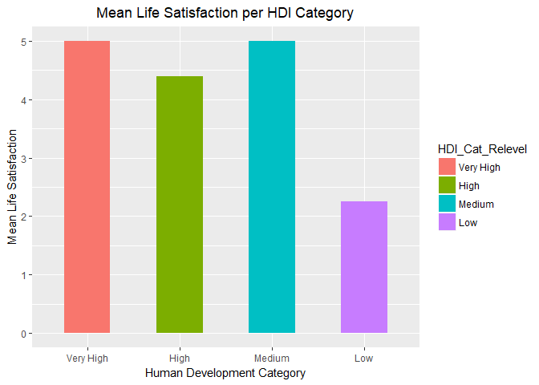

# Procrastination Tendencies of Company Corp. Customers
Jose Torres and Lisa Street  
November 29, 2017  

<br>

## Introduction

<br>

Procrastination is broadly defined as the avoidance of performing a task that needs to be accomplished.  The tasks in question can be of any magnitude and vary greatly in scope and impact.  A person's self-view of their own procrastination tendencies can be difficult to measure or define. However, over the years several procrastination scales have been developed to help shed light on the subject. The impact of procrastination can be great, but the sooner a person can understand their own proclivity towards task avoidance, the better the chance they have to work on these challenges. 

In order to gain better insight of the personal and work habits of its customers, Company Corp. has asked the data scientists from Cool DS Inc to perform an analysis of the subject within its own company's customer population. Since the customer count of Company Corp. is over 1 million, a random sample from the customer population of each country where Company Corp. retains a physical office, was taken. Each randomly assigned customer was given a survey that included questions regarding personal qualities such as age, income, marital status, etc., as well as a set of questions to be answered from four different procrastination scales (_see MSDS_CaseStudy2_Master_Codebook.MD for procrastination scale details_). In addition, Cool DS Inc. aligned these results with the estimated Human Development Index factor for each country represented in the survey, to get a better idea of the correlation between a countries HDI and an individual's tendency to procrastinate. The following analysis details the findings from Cool DS Inc's study of procrastination within Company Corp.'s population.
  

<br>


#### Install necessary packages if not installed:


```r
if (!is.element("dplyr", installed.packages()[,1]))
  install.packages("dplyr",repos="http://cran.rstudio.com")
if (!is.element("ggplot2", installed.packages()[,1]))
  install.packages("ggplot2",repos="http://cran.rstudio.com")
if (!is.element("stringr", installed.packages()[,1]))
  install.packages("stringr",repos="http://cran.rstudio.com")
if (!is.element("rvest", installed.packages()[,1]))
  install.packages("rvest",repos="http://cran.rstudio.com")
if (!is.element("xml2", installed.packages()[,1]))
  install.packages("xml2",repos="http://cran.rstudio.com")
 if (!is.element("tidyr", installed.packages()[,1]))
  install.packages("tidyr",repos="http://cran.rstudio.com")
if (!is.element("curl", installed.packages()[,1]))
  install.packages("curl",repos="http://cran.rstudio.com")
if (!is.element("stargazer", installed.packages()[,1]))
  install.packages("stargazer",repos="http://cran.rstudio.com")
if (!is.element("stringi", installed.packages()[,1]))
  install.packages("stringi",repos="http://cran.rstudio.com")
if (!is.element("scales", installed.packages()[,1]))
  install.packages("scales",repos="http://cran.rstudio.com")
if (!is.element("kableExtra", installed.packages()[,1]))
  install.packages("kableExtra",repos="http://cran.rstudio.com")
if (!is.element("knitr", installed.packages()[,1]))
  install.packages("knitr",repos="http://cran.rstudio.com")
```


#### Load custom functions created by Cool DS Inc.  


```r
#Custom functions for Case Study 2
#Please open MSDS6306_Final_Case_Study_Functions.R for more details
#Last modified 11/26/17

source('MSDS6306_Final_Case_Study_Functions.R')
```
<br>

#### Gather Data for Analysis

The first task performed by Cool DS Inc. was to survey 4,264 customers within Company Corp's universal customer population. The customers surveyed were taken by random sample and each customer was asked to fill out a questionnaire consisting of 61 questions related to personal and procrastination scale questions.  Some of the questions were limited in answer by drop-down, and some allowed the customer to 'write-in' their own response. Results of each individual's survey were tallied and consolidated into one master spreadsheet. Because write-in was allowed on some questions, data clean-up on the final consolidated survey was required.  The average procrastination score across the four procrastination scales was calculated as well. The information below details how the data transformation and cleanup was performed.

<br>


```r
# 2: Read in and clean raw data

# 2A: Read in CSV
filepath = 'C:\\SMU_INTRO_TO_DS\\CASESTUDY2\\CS2\\JoseLisa\\FINAL\\Data'
dataset_raw <- read.csv(paste(filepath,'Procrastination.csv',sep='\\'))

dim(dataset_raw)
```

```
## [1] 4264   61
```

```r
# There are 4264 rows and 61 columns in the procrastination dataset.


# 2B: Partition Procrastination into 2 tables (Attributes and Responses/Answers) and update column names
ID = 1:dim(dataset_raw)[1]
resp_attr = cbind(ID,dataset_raw[,1:14])
resp_answers = cbind(ID,dataset_raw[,15:length(dataset_raw)])

resp_attr_names = c('ID','Age','Gender','Kids','Edu','Work_Status',
		'Annual_Inc','Current_Occ','Employ_Yrs','Employ_Mths',
		'Comm_Size','Country_Res','Married','Num_sons',
		'Num_daught')

resp_answer_names = c('ID',paste('DP_',1:5,sep=''),paste('AIP_',1:15,sep=''),
											paste('GP_',1:20,sep=''),paste('SWLS_',1:5,sep=''),'
_Score','Others_Score')

colnames(resp_attr) = resp_attr_names
colnames(resp_answers) = resp_answer_names


# 2C: Cleanup the data

# 2Ci through 2civ:

# Begin by converting all blank or empty strings to NA in the entire data set
resp_attr = gsubkeep(pattern='^$|^ $',replacement=NA,x=resp_attr)


# Now go through individual attributes list and replace 'bad' values with NA
cleanup_list = data.frame(rbind(c(' Kids$','',4), #remove 'Kids'
		c('0', NA, 6), #Work status
		c('0|please specify',NA,8), #Occupation 
		c('999',NA,9), #Employment Years
		c('[08]',NA,11), #Community Size
		c('0',NA,12), #Country of Residence
		c('0',NA,13), #Married
		c('Male','1',14), #Number of sons
		c('Female','2',14))) #Number of sons

# Employ_Yrs_num - replace small numbers with 0.  Round to nearest integer.
resp_attr[which(resp_attr[,9] < .5),9] = 0
resp_attr[,9] = as.integer(round(resp_attr[,9],digits=0))

# Num_sons_fac - Convert to numeric
resp_attr[,14] = as.integer(resp_attr[,14])

# Num_daughters_num - no change

# 2d:
# Set columns to the proper data types
for (i in 1:dim(cleanup_list)[1]) {
	pattern = as.character(cleanup_list[i,1])
	replacement = as.character(cleanup_list[i,2])
	column = as.integer(as.character(cleanup_list[i,3]))
	resp_attr[,column] = gsubkeep(pattern=pattern,replacement=replacement,x=resp_attr[,column])
}


# 2e:
# Assign mean columns for the 4 response categories
resp_answers$DP_Avg = round(apply(X=resp_answers[,2:6],MARGIN=1,FUN=mean),5)
resp_answers$AIP_Avg = round(apply(X=resp_answers[,7:21],MARGIN=1,FUN=mean),5)
resp_answers$GP_Avg = round(apply(X=resp_answers[,22:41],MARGIN=1,FUN=mean),5)
resp_answers$SWLS_Avg = round(apply(X=resp_answers[,42:46],MARGIN=1,FUN=mean),5)
```

<br>

"The Human Development Index (HDI) is a summary measure of average achievement in key dimensions of human development: a long and healthy life, being knowledgeable and have a decent standard of living. The HDI is the geometric mean of normalized indices for each of the three dimensions". _(ref: United Nation's Development Program)_
http://hdr.undp.org/en/content/human-development-index-hdi

In addition to the survey, data was scraped from the UN's HDI Wikipedia site noted in the code snippet below, which assigns the 2016 estimated HDI for 2015, by country. This data was then merged with the survey data, by country, to test for correlation between procrastination and the estimated HDI factor.  

<br>


```r
# Scrape the Wikipedia website for the 8 HDI data tables

URL = 'https://en.wikipedia.org/wiki/List_of_countries_by_Human_Development_Index#Complete_list_of_countries'

html_resp = read_html(URL)

#HDI_data is a single data frame country and HDI
HDI_data = 
	html_nodes(html_resp,css='table.wikitable') %>%
	html_table(fill=TRUE) %>%
	list_rowbind(elements=c(1:8),cols=c(3,4),colname=c('Country','HDI'))

#Cleaning up HDI data and adding categories
HDI_data = subset(HDI_data,HDI_data[,1] != 'Change in rank from previous year[1]')
rownames(HDI_data) = 1:dim(HDI_data)[1]
HDI_data$HDI_Cat = c(rep('Very High',51),rep('High',56),rep('Medium',41),rep('Low',41))
HDI_data$HDI = as.numeric(HDI_data$HDI)

#Attach HDI data to attribute table, and maintain original row ordering
resp_attrwHDI = merge(x=resp_attr,y=HDI_data,by.x='Country_Res',by.y='Country',all.x=TRUE,incomparables=NA)
resp_attrwHDI = resp_attrwHDI[order(resp_attrwHDI$ID),]
```

<br>

#### Preliminary Analysis

Within the random sample population, some of the respondents turned out to be minors. This was noted by any respondent with an age of under 18.  Company Corp. advised Cool DS Inc. that minors should not be included in the analysis, so these respondents were removed from further review. This resulted in a new subset of 4,036 respondents.

<br>


```r
# 4A:
# Remove respondents under 18 from resp_attr and resp_answers
row_keep = which(resp_attrwHDI$Age>=18)
resp_attrwHDI = resp_attrwHDI[row_keep,]
resp_answers = resp_answers[row_keep,]


#Merge attributes with question answers for analysis
resp_full = merge(x=resp_answers,y=resp_attrwHDI,by.x='ID',by.y='ID',all.y=TRUE)
```

<br>

One of the first things found from a statistical analysis across the data population, are the descriptive statistics on Age, Income, HDI and the average response for the four procrastination scales.  Something to note is the N, or number of individuals measured in the descriptive statistic.  For annual income this number is 3,621.  This number is less than the 4,036 total population because some customers left the annual income survey field empty.  Also to note, the N for HDI is 3,844.  This is due to some respondents not populating their county of residence within the survey. So when the HDI statistics were calculated, those with a country of residence of NA were not included.

<br>


```r
# 4B:
#statistics table
stargazer(resp_full[,c('Age','Annual_Inc','HDI','DP_Avg','AIP_Avg','GP_Avg','SWLS_Avg')],
	summary.stat=c('n','min','p25','median','p75','max','mean','sd'),type='text')
```

```
## 
## ==============================================================================
## Statistic    N    Min   Pctl(25) Median Pctl(75)   Max      Mean     St. Dev. 
## ------------------------------------------------------------------------------
## Age        4,036 19.000  28.000  37.500  45.000  80.000    38.284     13.718  
## Annual_Inc 3,621 10,000  15,000  45,000  87,500  250,000 59,879.870 55,329.930
## HDI        3,844 0.479   0.920   0.920   0.920    0.949    0.906      0.056   
## DP_Avg     4,036 1.000   2.400   3.000   3.800    5.000    3.052      0.970   
## AIP_Avg    4,036 1.000   2.400   2.933   3.533    5.000    2.964      0.804   
## GP_Avg     4,036 1.000   2.800   3.250   3.750    5.000    3.239      0.689   
## SWLS_Avg   4,036 1.000   2.400   3.000   3.800    5.000    3.047      0.973   
## ------------------------------------------------------------------------------
```

<br>

The graphs below show a histogram of Age, HDI and Annual Income across respondents.  The boxplot chart gives a measure of the average of each of our procrastination scales.  The histogram of Age shows for the most part as normally distributed.  However, the HDI histogram shows as very left skewed and the histogram of Annual Income as fairly right-skewed with a bit of bimodality.

Also included are frequency tables that provide Company Corp. with a better idea of the population distribution of its customer base. What's interesting is the high number of individuals who self-describe as procrastinators and those who are also viewed as procrastinators by others.

_Please note that the frequency tables for Occupation Category and Participants Per Country are rather large, so the top 10 and 20 of each table, are displayed.  For details on how the Occupation Category keywords were matched, and for a list of the Remaining Counties in the Participants per Country list, please see the 'Job_Keyword_Mapping.csv' and 'Remaing_Countries.csv' files for details._

<br>


```r
h1 = gghistogram(resp_full,x='Age',y='..count..',
		bins=10,
		fill='blue',
		size=2,
		title='Histogram of Age',
		color='white',
		ylab='Count'
)

h1 = h1 + font('xy.text',size=12) + theme(plot.title=element_text(hjust=0.5))


h2 = gghistogram(resp_full,x='Annual_Inc',y='..count..',
		fill='blueviolet',
		size=2,
		bins=25,
		title='Histogram of Annual Income',
		color='white',
		ylab='Count',
		xlab='Annual Income'
)

Annual_Inc_Clean = resp_full[which(!is.na(resp_full$Annual_Inc)),'Annual_Inc']

h2 = h2 + font('xy.text',size=12) + 
  theme(plot.title=element_text(hjust=0.5)) +
  rotate_x_text(30) +
  scale_x_continuous(label=dollar_format(),breaks = round(seq(min(Annual_Inc_Clean), max(Annual_Inc_Clean), by = 50000),1))

h3 = gghistogram(resp_full,x='HDI',y='..count..',
		bins=10,
		fill='cadetblue3',
		size=2,
		title='Histogram of HDI',
		color='white',
		ylab='Count'
)

h3 = h3 + font('xy.text',size=12) + theme(plot.title=element_text(hjust=0.5))

DPMetric <- resp_full["DP_Avg"]
DPMetric$Variable <- 'DP_Avg'
colnames(DPMetric) <- c("Value","Variable")

AIPMetric <- resp_full["AIP_Avg"]
AIPMetric$Variable <- 'AIP_Avg'
colnames(AIPMetric) <- c("Value","Variable")

GPMetric <- resp_full["GP_Avg"]
GPMetric$Variable <- 'GP_Avg'
colnames(GPMetric) <- c("Value","Variable")

SWLSMetric <- resp_full["SWLS_Avg"]
SWLSMetric$Variable <- 'SWLS_Avg'
colnames(SWLSMetric) <- c("Value","Variable")

metrics <- rbind(DPMetric, AIPMetric, GPMetric, SWLSMetric)

h4 = ggboxplot(metrics,x='Variable',
		y='Value',
		color='Variable',
		palette='jco',
		size=1,
		xlab='')


h4 = h4 + font('xy.text',size=12) + theme(plot.title=element_text(hjust=0.5)) +
  rotate_x_text(30)

ggarrange(h1,h3,
	h2,h4,
	nrow=2,
	ncol=2)
```

<!-- -->

```r
# 4C:


#Categorize occupations for table

jobs = cbind(as.character(resp_full$Current_Occ), NA)

jobs_matrix = unlist(apply(jobs,MARGIN=2,FUN=function(x){strsplit(x,' ')})) %>%
	gsub(pattern='[[:punct:]]',replacement='') %>%
	gsub(pattern='^$|^ $',replacement=NA) 

jobs_matrix = unlist(apply(jobs,MARGIN=2,FUN=function(x){strsplit(x,' ')})) %>%
	gsub(pattern='[[:punct:]]',replacement='') %>%
	gsub(pattern='^$|^ $',replacement=NA) %>%
	subset(!is.na(jobs_matrix))


jobs_matrix = as.factor(tolower(jobs_matrix))

jobs_count = as.data.frame(table(jobs_matrix))
colnames(jobs_count)=c('title','count')
jobs_count = jobs_count[order(jobs_count$count,jobs_count$title,decreasing=TRUE),]

#Get top 10 job keywords
keywords = jobs_count[1:10,]

keywords_del = c('and','of')
top10Jobs = subset(keywords,!keywords$title %in% keywords_del)

#For the codebook only
#These are the job assignments we subjectively made to get the top10 job counts shown:
top_jobs = match_list(resp_full$Current_Occ,findtext=keywords$title)
joblist_replace = character()
for (i in 1:length(top10Jobs$title)) {
joblist_replace = c(joblist_replace,paste(tolower(as.character(top10Jobs$title[i])),'<-', unique(unique(top_jobs[[i]][,2]))))
}
write.csv(joblist_replace,'Job_Keyword_Mapping.csv')


# Frequencies per column 
# Unique distributions

# Gender
gender_table = as.data.frame(table(resp_full$Gender))
colnames(gender_table) = c('Gender','Count')
kable(gender_table,row.names=FALSE,format='html')%>%
  kable_styling(bootstrap_options='striped',full_width=FALSE)%>%
  row_spec(row=1:dim(gender_table)[1],bold=T,color='white',background='darkred')
```

<table class="table table-striped" style="width: auto !important; margin-left: auto; margin-right: auto;">
<thead><tr>
<th style="text-align:left;"> Gender </th>
   <th style="text-align:right;"> Count </th>
  </tr></thead>
<tbody>
<tr>
<td style="text-align:left;font-weight: bold;color: white;background-color: darkred;"> Female </td>
   <td style="text-align:right;font-weight: bold;color: white;background-color: darkred;"> 2309 </td>
  </tr>
<tr>
<td style="text-align:left;font-weight: bold;color: white;background-color: darkred;"> Male </td>
   <td style="text-align:right;font-weight: bold;color: white;background-color: darkred;"> 1721 </td>
  </tr>
</tbody>
</table>

```r
# WorkStatus
work_table = as.data.frame(table(resp_full$Work_Status))
colnames(work_table) = c('Status','Count')
work_table = work_table[order(work_table$Count,decreasing=TRUE),]
kable(work_table,row.names=FALSE,format='html')%>%
  kable_styling(bootstrap_options=c('striped','condensed'),full_width=FALSE)%>%
  row_spec(row=1:dim(work_table)[1],bold=T,color='white',background='darkred')
```

<table class="table table-striped table-condensed" style="width: auto !important; margin-left: auto; margin-right: auto;">
<thead><tr>
<th style="text-align:left;"> Status </th>
   <th style="text-align:right;"> Count </th>
  </tr></thead>
<tbody>
<tr>
<td style="text-align:left;font-weight: bold;color: white;background-color: darkred;"> full-time </td>
   <td style="text-align:right;font-weight: bold;color: white;background-color: darkred;"> 2260 </td>
  </tr>
<tr>
<td style="text-align:left;font-weight: bold;color: white;background-color: darkred;"> student </td>
   <td style="text-align:right;font-weight: bold;color: white;background-color: darkred;"> 837 </td>
  </tr>
<tr>
<td style="text-align:left;font-weight: bold;color: white;background-color: darkred;"> part-time </td>
   <td style="text-align:right;font-weight: bold;color: white;background-color: darkred;"> 465 </td>
  </tr>
<tr>
<td style="text-align:left;font-weight: bold;color: white;background-color: darkred;"> unemployed </td>
   <td style="text-align:right;font-weight: bold;color: white;background-color: darkred;"> 258 </td>
  </tr>
<tr>
<td style="text-align:left;font-weight: bold;color: white;background-color: darkred;"> retired </td>
   <td style="text-align:right;font-weight: bold;color: white;background-color: darkred;"> 174 </td>
  </tr>
</tbody>
</table>

```r
#Distributions across Gender and Work Status
genderwork_table = as.data.frame(table(resp_full$Gender,resp_full$Work_Status))
colnames(genderwork_table) = c('Gender','Work_Status','Count')
genderwork_table = genderwork_table[order(genderwork_table$Count,decreasing=TRUE),]
kable(genderwork_table,row.names=FALSE,format='html')%>%
  kable_styling(bootstrap_options='striped',full_width=FALSE)%>%
  row_spec(row=1:dim(genderwork_table)[1],bold=T,color='white',background='darkred')
```

<table class="table table-striped" style="width: auto !important; margin-left: auto; margin-right: auto;">
<thead><tr>
<th style="text-align:left;"> Gender </th>
   <th style="text-align:left;"> Work_Status </th>
   <th style="text-align:right;"> Count </th>
  </tr></thead>
<tbody>
<tr>
<td style="text-align:left;font-weight: bold;color: white;background-color: darkred;"> Female </td>
   <td style="text-align:left;font-weight: bold;color: white;background-color: darkred;"> full-time </td>
   <td style="text-align:right;font-weight: bold;color: white;background-color: darkred;"> 1209 </td>
  </tr>
<tr>
<td style="text-align:left;font-weight: bold;color: white;background-color: darkred;"> Male </td>
   <td style="text-align:left;font-weight: bold;color: white;background-color: darkred;"> full-time </td>
   <td style="text-align:right;font-weight: bold;color: white;background-color: darkred;"> 1047 </td>
  </tr>
<tr>
<td style="text-align:left;font-weight: bold;color: white;background-color: darkred;"> Female </td>
   <td style="text-align:left;font-weight: bold;color: white;background-color: darkred;"> student </td>
   <td style="text-align:right;font-weight: bold;color: white;background-color: darkred;"> 504 </td>
  </tr>
<tr>
<td style="text-align:left;font-weight: bold;color: white;background-color: darkred;"> Male </td>
   <td style="text-align:left;font-weight: bold;color: white;background-color: darkred;"> student </td>
   <td style="text-align:right;font-weight: bold;color: white;background-color: darkred;"> 333 </td>
  </tr>
<tr>
<td style="text-align:left;font-weight: bold;color: white;background-color: darkred;"> Female </td>
   <td style="text-align:left;font-weight: bold;color: white;background-color: darkred;"> part-time </td>
   <td style="text-align:right;font-weight: bold;color: white;background-color: darkred;"> 312 </td>
  </tr>
<tr>
<td style="text-align:left;font-weight: bold;color: white;background-color: darkred;"> Female </td>
   <td style="text-align:left;font-weight: bold;color: white;background-color: darkred;"> unemployed </td>
   <td style="text-align:right;font-weight: bold;color: white;background-color: darkred;"> 168 </td>
  </tr>
<tr>
<td style="text-align:left;font-weight: bold;color: white;background-color: darkred;"> Male </td>
   <td style="text-align:left;font-weight: bold;color: white;background-color: darkred;"> part-time </td>
   <td style="text-align:right;font-weight: bold;color: white;background-color: darkred;"> 152 </td>
  </tr>
<tr>
<td style="text-align:left;font-weight: bold;color: white;background-color: darkred;"> Male </td>
   <td style="text-align:left;font-weight: bold;color: white;background-color: darkred;"> unemployed </td>
   <td style="text-align:right;font-weight: bold;color: white;background-color: darkred;"> 89 </td>
  </tr>
<tr>
<td style="text-align:left;font-weight: bold;color: white;background-color: darkred;"> Male </td>
   <td style="text-align:left;font-weight: bold;color: white;background-color: darkred;"> retired </td>
   <td style="text-align:right;font-weight: bold;color: white;background-color: darkred;"> 88 </td>
  </tr>
<tr>
<td style="text-align:left;font-weight: bold;color: white;background-color: darkred;"> Female </td>
   <td style="text-align:left;font-weight: bold;color: white;background-color: darkred;"> retired </td>
   <td style="text-align:right;font-weight: bold;color: white;background-color: darkred;"> 86 </td>
  </tr>
</tbody>
</table>

```r
kable(top10Jobs,row.names=FALSE,format='html')%>%
  kable_styling(bootstrap_options='striped',full_width=FALSE)%>%
  row_spec(row=1:dim(top10Jobs)[1],bold=T,color='white',background='darkred')
```

<table class="table table-striped" style="width: auto !important; margin-left: auto; margin-right: auto;">
<thead><tr>
<th style="text-align:left;"> title </th>
   <th style="text-align:right;"> count </th>
  </tr></thead>
<tbody>
<tr>
<td style="text-align:left;font-weight: bold;color: white;background-color: darkred;"> teacher </td>
   <td style="text-align:right;font-weight: bold;color: white;background-color: darkred;"> 90 </td>
  </tr>
<tr>
<td style="text-align:left;font-weight: bold;color: white;background-color: darkred;"> manager </td>
   <td style="text-align:right;font-weight: bold;color: white;background-color: darkred;"> 84 </td>
  </tr>
<tr>
<td style="text-align:left;font-weight: bold;color: white;background-color: darkred;"> assistant </td>
   <td style="text-align:right;font-weight: bold;color: white;background-color: darkred;"> 65 </td>
  </tr>
<tr>
<td style="text-align:left;font-weight: bold;color: white;background-color: darkred;"> professor </td>
   <td style="text-align:right;font-weight: bold;color: white;background-color: darkred;"> 56 </td>
  </tr>
<tr>
<td style="text-align:left;font-weight: bold;color: white;background-color: darkred;"> attorney </td>
   <td style="text-align:right;font-weight: bold;color: white;background-color: darkred;"> 53 </td>
  </tr>
<tr>
<td style="text-align:left;font-weight: bold;color: white;background-color: darkred;"> engineer </td>
   <td style="text-align:right;font-weight: bold;color: white;background-color: darkred;"> 46 </td>
  </tr>
<tr>
<td style="text-align:left;font-weight: bold;color: white;background-color: darkred;"> college </td>
   <td style="text-align:right;font-weight: bold;color: white;background-color: darkred;"> 46 </td>
  </tr>
<tr>
<td style="text-align:left;font-weight: bold;color: white;background-color: darkred;"> director </td>
   <td style="text-align:right;font-weight: bold;color: white;background-color: darkred;"> 45 </td>
  </tr>
<tr>
<td style="text-align:left;font-weight: bold;color: white;background-color: darkred;"> consultant </td>
   <td style="text-align:right;font-weight: bold;color: white;background-color: darkred;"> 44 </td>
  </tr>
<tr>
<td style="text-align:left;font-weight: bold;color: white;background-color: darkred;"> analyst </td>
   <td style="text-align:right;font-weight: bold;color: white;background-color: darkred;"> 38 </td>
  </tr>
</tbody>
</table>

```r
# 4D:

# Counts of participants per country in descending order

countryCt = as.data.frame(table(resp_full$Country_Res))
colnames(countryCt) = c('Country','Count')
sortedCC = countryCt[order(countryCt$Count, decreasing = TRUE),]
kable(head(sortedCC,19),row.names=FALSE,format='html')%>%
  kable_styling(bootstrap_options='striped',full_width=FALSE)%>%
  row_spec(row=1:19,bold=T,color='white',background='darkred')
```

<table class="table table-striped" style="width: auto !important; margin-left: auto; margin-right: auto;">
<thead><tr>
<th style="text-align:left;"> Country </th>
   <th style="text-align:right;"> Count </th>
  </tr></thead>
<tbody>
<tr>
<td style="text-align:left;font-weight: bold;color: white;background-color: darkred;"> United States </td>
   <td style="text-align:right;font-weight: bold;color: white;background-color: darkred;"> 2785 </td>
  </tr>
<tr>
<td style="text-align:left;font-weight: bold;color: white;background-color: darkred;"> Canada </td>
   <td style="text-align:right;font-weight: bold;color: white;background-color: darkred;"> 243 </td>
  </tr>
<tr>
<td style="text-align:left;font-weight: bold;color: white;background-color: darkred;"> United Kingdom </td>
   <td style="text-align:right;font-weight: bold;color: white;background-color: darkred;"> 177 </td>
  </tr>
<tr>
<td style="text-align:left;font-weight: bold;color: white;background-color: darkred;"> Australia </td>
   <td style="text-align:right;font-weight: bold;color: white;background-color: darkred;"> 99 </td>
  </tr>
<tr>
<td style="text-align:left;font-weight: bold;color: white;background-color: darkred;"> India </td>
   <td style="text-align:right;font-weight: bold;color: white;background-color: darkred;"> 78 </td>
  </tr>
<tr>
<td style="text-align:left;font-weight: bold;color: white;background-color: darkred;"> Italy </td>
   <td style="text-align:right;font-weight: bold;color: white;background-color: darkred;"> 62 </td>
  </tr>
<tr>
<td style="text-align:left;font-weight: bold;color: white;background-color: darkred;"> Germany </td>
   <td style="text-align:right;font-weight: bold;color: white;background-color: darkred;"> 36 </td>
  </tr>
<tr>
<td style="text-align:left;font-weight: bold;color: white;background-color: darkred;"> Brazil </td>
   <td style="text-align:right;font-weight: bold;color: white;background-color: darkred;"> 20 </td>
  </tr>
<tr>
<td style="text-align:left;font-weight: bold;color: white;background-color: darkred;"> Ireland </td>
   <td style="text-align:right;font-weight: bold;color: white;background-color: darkred;"> 19 </td>
  </tr>
<tr>
<td style="text-align:left;font-weight: bold;color: white;background-color: darkred;"> Isreal </td>
   <td style="text-align:right;font-weight: bold;color: white;background-color: darkred;"> 19 </td>
  </tr>
<tr>
<td style="text-align:left;font-weight: bold;color: white;background-color: darkred;"> Netherlands </td>
   <td style="text-align:right;font-weight: bold;color: white;background-color: darkred;"> 18 </td>
  </tr>
<tr>
<td style="text-align:left;font-weight: bold;color: white;background-color: darkred;"> Sweden </td>
   <td style="text-align:right;font-weight: bold;color: white;background-color: darkred;"> 15 </td>
  </tr>
<tr>
<td style="text-align:left;font-weight: bold;color: white;background-color: darkred;"> Norway </td>
   <td style="text-align:right;font-weight: bold;color: white;background-color: darkred;"> 14 </td>
  </tr>
<tr>
<td style="text-align:left;font-weight: bold;color: white;background-color: darkred;"> France </td>
   <td style="text-align:right;font-weight: bold;color: white;background-color: darkred;"> 13 </td>
  </tr>
<tr>
<td style="text-align:left;font-weight: bold;color: white;background-color: darkred;"> Japan </td>
   <td style="text-align:right;font-weight: bold;color: white;background-color: darkred;"> 13 </td>
  </tr>
<tr>
<td style="text-align:left;font-weight: bold;color: white;background-color: darkred;"> Spain </td>
   <td style="text-align:right;font-weight: bold;color: white;background-color: darkred;"> 13 </td>
  </tr>
<tr>
<td style="text-align:left;font-weight: bold;color: white;background-color: darkred;"> China </td>
   <td style="text-align:right;font-weight: bold;color: white;background-color: darkred;"> 12 </td>
  </tr>
<tr>
<td style="text-align:left;font-weight: bold;color: white;background-color: darkred;"> Finland </td>
   <td style="text-align:right;font-weight: bold;color: white;background-color: darkred;"> 12 </td>
  </tr>
<tr>
<td style="text-align:left;font-weight: bold;color: white;background-color: darkred;"> Mexico </td>
   <td style="text-align:right;font-weight: bold;color: white;background-color: darkred;"> 12 </td>
  </tr>
</tbody>
</table>

```r
write.csv(sortedCC[21:length(sortedCC$Country),],'Remaining_Countries.csv')


# 4E:


# Find the number of people whose self view matched others view

resp_full$Others_Score <- as.character(resp_full$Others_Score)
resp_full$Self_Score <- as.character(resp_full$Self_Score)

match_yes = sum(resp_full$Self_Score == 'yes' & resp_full$Others_Score == 'yes')
match_no = sum(resp_full$Self_Score == 'no' & resp_full$Others_Score == 'no')
match_either = as.data.frame(cbind(match_yes,match_no))
colnames(match_either) = c('Others Agree I Procrastinate','Others Agree I Do Not Procrastinate')
kable(match_either,row.names=FALSE,format='html')%>%
  kable_styling(bootstrap_options='striped',full_width=FALSE)%>%
  row_spec(row=1:1,bold=T,color='black',background='beige')%>%
  column_spec(1:2,width='1cm')
```

<table class="table table-striped" style="width: auto !important; margin-left: auto; margin-right: auto;">
<thead><tr>
<th style="text-align:right;"> Others Agree I Procrastinate </th>
   <th style="text-align:right;"> Others Agree I Do Not Procrastinate </th>
  </tr></thead>
<tbody><tr>
<td style="text-align:right;font-weight: bold;color: black;background-color: beige;width: 1cm; "> 2358 </td>
   <td style="text-align:right;font-weight: bold;color: black;background-color: beige;width: 1cm; "> 482 </td>
  </tr></tbody>
</table>

<br>

#### Deeper Analysis and Visualization

A deeper analysis of the data are also shown below. For several analyses, a mean value was taken in order to provide a cleaner perspective of the population as whole, instead of displaying unique values. This aids in the visualization of the variables. A few interesting things to note:

* There are 6 countries that exist in both the DP and AIP top 15 Means. They are: Dominican Republic, Ecuador, Panama, Qatar, Sri Lanka   and Uraguay.

* As noted by the 'Average Annual Income vs Average Age' graph, there does seem to be a linear relationship between age and mean annual 	income until about age 40.  However, starting at around age 40, an income disparity between men and women can be seen that continues   with age progression.
  
* The 'Mean Life Satisfaction Mean by Mean HDI' scatterplot does not show a discernable relationship between the Satisfaction with Life
  Scale and mean HDI factor. However, the 'Mean Life Satisfaction per HDI Category' barplot does signify some relationship 
  between the Satisfaction with Life Scale and the HDI Category (Very High, High, Medium and Low), with the Low HDI Category having the   lowest SWLS average.

<br>


```r
# 5B:

DPMeanSub <- resp_full[,c("Country_Res","DP_Avg", "HDI_Cat")]
DPMeanAvg <- aggregate(DP_Avg~Country_Res, DPMeanSub, mean)
DPMeanUnique <- aggregate(HDI_Cat~Country_Res, DPMeanSub, unique)

DPMeanAvgHDI <- merge(DPMeanAvg, DPMeanUnique , by.x=c("Country_Res"),
											by.y=c("Country_Res"))


SortedDP <- DPMeanAvgHDI[order(DPMeanAvgHDI$DP_Avg, decreasing = TRUE),]
Top15DP <- SortedDP[1:15,]


##Set chunk size for output
ggplot(Top15DP, aes(reorder(Country_Res, -DP_Avg), DP_Avg))+
	geom_bar(aes(fill=HDI_Cat), stat="identity")+
	ggtitle("Countries with the top 15 DP Average") +
	theme(plot.title = element_text(hjust = 0.5),axis.text.x=element_text(angle=45,hjust=1)) +
	xlab("Country Name")+
	ylab("DP Mean Value")
```

<!-- -->

```r
# 5C:
AIPMeanSub <- resp_full[,c("Country_Res","AIP_Avg", "HDI_Cat")]
AIPMeanAvg <- aggregate(AIP_Avg~Country_Res, AIPMeanSub, mean)
AIPMeanUnique <- aggregate(HDI_Cat~Country_Res, AIPMeanSub, unique)

AIPMeanAvgHDI <- merge(AIPMeanAvg, AIPMeanUnique , by.x=c("Country_Res"),
											 by.y=c("Country_Res"))


SortedAIP <- AIPMeanAvgHDI[order(AIPMeanAvgHDI$AIP_Avg, decreasing = TRUE),]
Top15AIP <- SortedAIP[1:15,]


##Set chunk size for output
ggplot(Top15AIP, aes(reorder(Country_Res, -AIP_Avg), AIP_Avg))+
	geom_bar(aes(fill=HDI_Cat), stat="identity")+
	ggtitle("Countries with the top 15 AIP Average") +
	theme(plot.title = element_text(hjust = 0.5),axis.text.x=element_text(angle=45,hjust=1)) +
	xlab("Country Name")+
	ylab("AIP Mean Value")+
  scale_x_discrete(labels=c("Dominican Republic"="Dom. Republic"))
```

<!-- -->

```r
#Find countries that exist in both the top 15 AIP and DP Means
merge(Top15DP, Top15AIP, by.x=c("Country_Res"), by.y=c("Country_Res"))
```

```
##          Country_Res   DP_Avg HDI_Cat.x  AIP_Avg HDI_Cat.y
## 1 Dominican Republic 3.800000      High 4.533330      High
## 2            Ecuador 4.133333      High 3.755553      High
## 3             Panama 5.000000      High 4.000000      High
## 4              Qatar 5.000000 Very High 4.066670 Very High
## 5          Sri Lanka 4.400000      High 3.733330      High
## 6            Uruguay 3.933333      High 3.600000      High
```

```r
# 5D:

# Subset merged data frame to only include those rows where Gender is not empty and Annual Income is not empty
mDFMF <- subset(resp_full[c("Country_Res","Age","Annual_Inc","Gender")], Gender != "" & Annual_Inc != "")

# Get the average income per age
mDFMFAvg <- aggregate(Annual_Inc~Age + Gender, mDFMF, mean)


h5 = ggscatter(mDFMFAvg,y='Annual_Inc',x='Age',
		color='Gender',
		size=2,
		title='Average Annual Income vs Average Age',
		ylab='Average Annual Income',
		xlab='Average Age')

h5 = h5 + font('xy.text',size=12) + theme(plot.title=element_text(hjust=0.5)) +
  scale_y_continuous(label=dollar_format(),breaks = round(seq(0, max(mDFMFAvg$Annual_Inc), by = 25000),1))

h5
```

<!-- -->

```r
# 5E: 

# Subset merged data frame to only include those rows where Gender is not empty
mDFHDI <- subset(resp_full[c("Country_Res","SWLS_Avg", "HDI", "HDI_Cat")])

mDFHDIAvg <- aggregate(SWLS_Avg~HDI + HDI_Cat, mDFHDI, mean)


par(mar=c(4,6,2,2))
plot(mDFHDIAvg$SWLS_Avg ~ mDFHDIAvg$HDI, xaxt="n", yaxt="n", pch = 16, cex = 1.3, col = "blue", xlab="", ylab="")
axis(1,at=pretty(mDFHDIAvg$HDI),labels=pretty(mDFHDIAvg$HDI),las=1)
axis(2,at=pretty(mDFHDIAvg$SWLS_Avg),labels=format(pretty(mDFHDIAvg$SWLS_Avg),big.mark=",", scientific=FALSE),las=1)
mtext(text="Mean HDI", side=1, line=2)
mtext(text="Mean Life Satisfaction", side=2, line=5)
title("Mean Life Satisfaction Mean by Mean HDI")
abline(lm(mDFHDIAvg$SWLS_Avg ~ mDFHDIAvg$HDI), col = "green")
```

<!-- -->

```r
# Barchart between HDI Category and Mean Life Satisfaction

mDFHDIAvg$HDI_Cat_Relevel = factor(mDFHDIAvg$HDI_Cat,levels=c('Very High','High','Medium','Low'))

ggplot(mDFHDIAvg, aes(fill=HDI_Cat_Relevel, y=SWLS_Avg, x=HDI_Cat_Relevel)) + 
	scale_x_discrete(labels=c("High Human Development" = "HHD", "Very High Human Development" = "VHHD",
	"Medium Human Development" = "MHD", "Low Human Development" = "LHD")) +
	geom_bar(position="dodge", stat="identity", width=.5) +
	ggtitle("Mean Life Satisfaction per HDI Category") +
	theme(plot.title = element_text(hjust = 0.5)) +
	xlab("Human Development Category") +
	ylab("Mean Life Satisfaction")
```

<!-- -->

<br>

### Conclusion

In conclusion, we are able to note several findings regarding Company Corp's customer population in terms of individual qualities and procrastination tendencies in relation to the Human Development Index of that individual's country of residence.

1. When assessing income, age and gender seem to matter.  As displayed in the 'Average Annual Income vs Average Age' graph, the relationship between age and income grows in a linear fashion regardless of gender, but beginning around age 40, the great income divide begins.  We cannot infer that gender alone is the cause of this income disparity, factors such as taking time off of work to raise children, etc. could play a role.  However, the findings are interesting.

2. There does seem to be a pattern among countries that procrastinate the most.  This can be found in the 'Countries with the top 15 AIP Average' histogram and the 'Countries with the top 15 DP Average' histogram, both which contain the countries of Dominican Republic, Ecuador, Panama, Qatar, Sri Lanka and Uruguay. Also, there does seem to be some correlation between the level of Procrastination with the HDI Category.  So do Company Corp. customers living in countries with higher Human Development Indices tend to procrastinate more?  It seems this may be the case, but further analysis may need to be performed.

Since a random sample of Company Corp's customer population was taken, we can make an inference of these findings across all of Company Corp's customer population. An output of the details of this study can also be found in the 'Procrastination Details.pdf' file.

<br>
