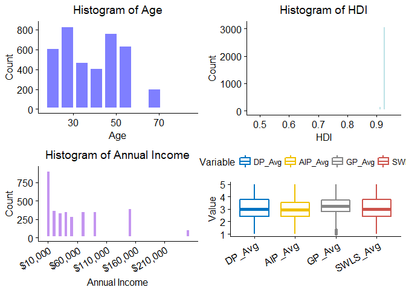
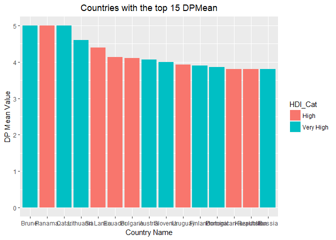
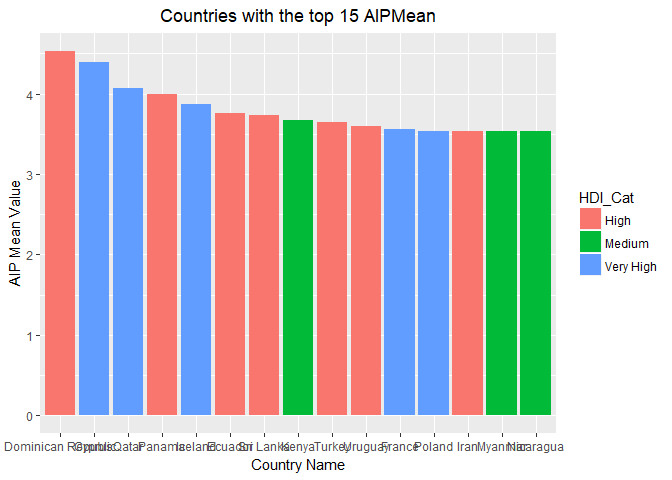
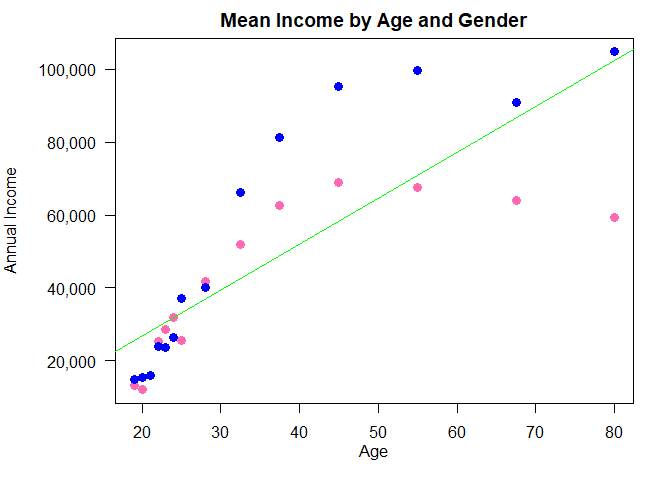
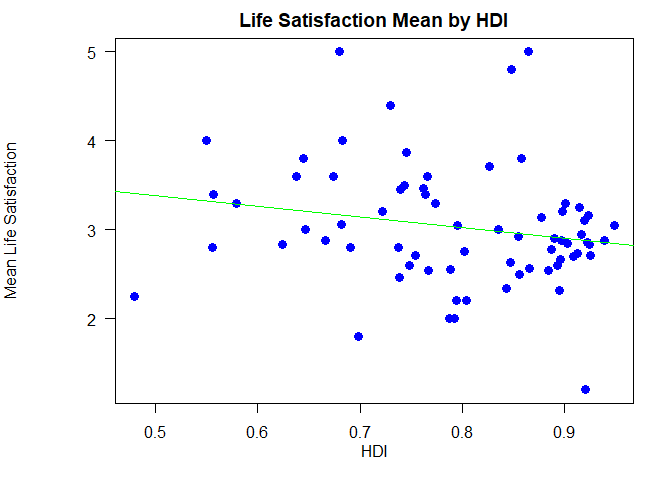
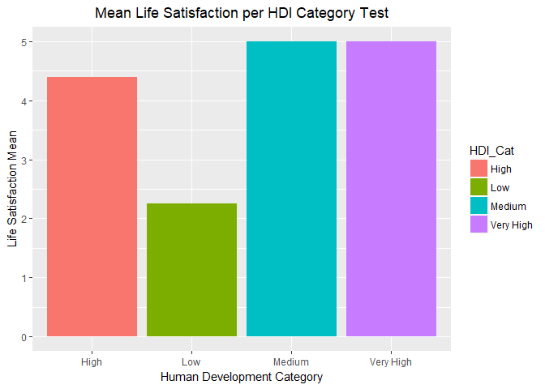

# MSDS Case Study 2 - Procrastination and HDI Data
Jose Torres and Lisa Street  
November 29, 2017  


## Installing Necessary Libraries

Install necessary packages if not installed:


```r
if (!is.element("dplyr", installed.packages()[,1]))
  install.packages("dplyr",repos="http://cran.rstudio.com")
if (!is.element("ggplot2", installed.packages()[,1]))
  install.packages("ggplot2",repos="http://cran.rstudio.com")
if (!is.element("stringr", installed.packages()[,1]))
  install.packages("stringr",repos="http://cran.rstudio.com")
if (!is.element("rvest", installed.packages()[,1]))
  install.packages("rvest",repos="http://cran.rstudio.com")
if (!is.element("xml2", installed.packages()[,1]))
  install.packages("xml2",repos="http://cran.rstudio.com")
 if (!is.element("tidyr", installed.packages()[,1]))
  install.packages("tidyr",repos="http://cran.rstudio.com")
if (!is.element("curl", installed.packages()[,1]))
  install.packages("curl",repos="http://cran.rstudio.com")
if (!is.element("stargazer", installed.packages()[,1]))
  install.packages("stargazer",repos="http://cran.rstudio.com")
if (!is.element("stringi", installed.packages()[,1]))
  install.packages("stringi",repos="http://cran.rstudio.com")
if (!is.element("scales", installed.packages()[,1]))
  install.packages("scales",repos="http://cran.rstudio.com")
if (!is.element("kableExtra", installed.packages()[,1]))
  install.packages("kableExtra",repos="http://cran.rstudio.com")
if (!is.element("knitr", installed.packages()[,1]))
  install.packages("knitr",repos="http://cran.rstudio.com")
```


## Load custom functions.


```r
#Custom functions for Case Study 2
#Please open MSDS6306_Final_Case_Study_Functions.R for more details
#Last modified 11/26/17

source('MSDS6306_Final_Case_Study_Functions.R')
```

## Question 2: Read in and clean raw data


```r
# 2: Read in and clean raw data

# 2A: Read in CSV
filepath = 'C:\\Users\\Jose\\Downloads\\Case_Study_2\\CaseStudy2_MSDS'
dataset_raw <- read.csv(paste(filepath,'Procrastination.csv',sep='\\'))

dim(dataset_raw)
```

```
## [1] 4264   61
```

```r
# There are 4264 rows and 61 columns in the procrastination dataset.


# 2B: Partition Procrastination into 2 tables (Attributes and Responses/Answers) and update column names
ID = 1:dim(dataset_raw)[1]
resp_attr = cbind(ID,dataset_raw[,1:14])
resp_answers = cbind(ID,dataset_raw[,15:length(dataset_raw)])

resp_attr_names = c('ID','Age','Gender','Kids','Edu','Work_Status',
										'Annual_Inc','Current_Occ','Employ_Yrs','Employ_Mths',
										'Comm_Size','Country_Res','Married','Num_sons',
										'Num_daught')

resp_answer_names = c('ID',paste('DP_',1:5,sep=''),paste('AIP_',1:15,sep=''),
											paste('GP_',1:20,sep=''),paste('SWLS_',1:5,sep=''),'Self_Score','Others_Score')

colnames(resp_attr) = resp_attr_names
colnames(resp_answers) = resp_answer_names


# 2C: Cleanup the data

# 2Ci through 2civ:

# Begin by converting all blank or empty strings to NA in the entire data set
resp_attr = gsubkeep(pattern='^$|^ $',replacement=NA,x=resp_attr)


# Now go through individual attributes list and replace 'bad' values with NA
cleanup_list = data.frame(rbind(c(' Kids$','',4), #remove 'Kids'
																c('0', NA, 6), #Work status
																c('0|please specify',NA,8), #Occupation 
																c('999',NA,9), #Employment Years
																c('[08]',NA,11), #Community Size
																c('0',NA,12), #Country of Residence
																c('0',NA,13), #Married
																c('Male','1',14), #Number of sons
																c('Female','2',14))) #Number of sons

# Employ_Yrs_num - replace small numbers with 0.  Round to nearest integer.
resp_attr[which(resp_attr[,9] < .5),9] = 0
resp_attr[,9] = as.integer(round(resp_attr[,9],digits=0))

# Num_sons_fac - Convert to numeric
resp_attr[,14] = as.integer(resp_attr[,14])

# Num_daughters_num - no change

# 2d:
# Set columns to the proper data types
for (i in 1:dim(cleanup_list)[1]) {
	pattern = as.character(cleanup_list[i,1])
	replacement = as.character(cleanup_list[i,2])
	column = as.integer(as.character(cleanup_list[i,3]))
	resp_attr[,column] = gsubkeep(pattern=pattern,replacement=replacement,x=resp_attr[,column])
}


# 2e:
# Assign mean columns for the 4 response categories
resp_answers$DP_Avg = round(apply(X=resp_answers[,2:6],MARGIN=1,FUN=mean),5)
resp_answers$AIP_Avg = round(apply(X=resp_answers[,7:21],MARGIN=1,FUN=mean),5)
resp_answers$GP_Avg = round(apply(X=resp_answers[,22:41],MARGIN=1,FUN=mean),5)
resp_answers$SWLS_Avg = round(apply(X=resp_answers[,42:46],MARGIN=1,FUN=mean),5)
```


## Question 3: HDI table scrape from Wikipedia


```r
# Scrape the Wikipedia website for the 8 HDI data tables

URL = 'https://en.wikipedia.org/wiki/List_of_countries_by_Human_Development_Index#Complete_list_of_countries'

html_resp = read_html(URL)

#HDI_data is a single data frame country and HDI
HDI_data = 
	html_nodes(html_resp,css='table.wikitable') %>%
	html_table(fill=TRUE) %>%
	list_rowbind(elements=c(1:8),cols=c(3,4),colname=c('Country','HDI'))

#Cleaning up HDI data and adding categories
HDI_data = subset(HDI_data,HDI_data[,1] != 'Change in rank from previous year[1]')
rownames(HDI_data) = 1:dim(HDI_data)[1]
HDI_data$HDI_Cat = c(rep('Very High',51),rep('High',56),rep('Medium',41),rep('Low',41))
HDI_data$HDI = as.numeric(HDI_data$HDI)

#Attach HDI data to attribute table, and maintain original row ordering
resp_attrwHDI = merge(x=resp_attr,y=HDI_data,by.x='Country_Res',by.y='Country',all.x=TRUE,incomparables=NA)
resp_attrwHDI = resp_attrwHDI[order(resp_attrwHDI$ID),]
```


# Question 4: Preliminary Analysis


```r
# 4A:
# Remove respondents under 18 from resp_attr and resp_answers
row_keep = which(resp_attrwHDI$Age>=18)
resp_attrwHDI = resp_attrwHDI[row_keep,]
resp_answers = resp_answers[row_keep,]


#Merge attributes with question answers for analysis
resp_full = merge(x=resp_answers,y=resp_attrwHDI,by.x='ID',by.y='ID',all.y=TRUE)


# 4B:
#statistics table
stargazer(resp_full[,c('Age','Annual_Inc','HDI','DP_Avg','AIP_Avg','GP_Avg','SWLS_Avg')],
					summary.stat=c('n','min','p25','median','p75','max','mean','sd'),type='text')
```

```
## 
## ==============================================================================
## Statistic    N    Min   Pctl(25) Median Pctl(75)   Max      Mean     St. Dev. 
## ------------------------------------------------------------------------------
## Age        4,036 19.000  28.000  37.500  45.000  80.000    38.284     13.718  
## Annual_Inc 3,621 10,000  15,000  45,000  87,500  250,000 59,879.870 55,329.930
## HDI        3,844 0.479   0.920   0.920   0.920    0.949    0.906      0.056   
## DP_Avg     4,036 1.000   2.400   3.000   3.800    5.000    3.052      0.970   
## AIP_Avg    4,036 1.000   2.400   2.933   3.533    5.000    2.964      0.804   
## GP_Avg     4,036 1.000   2.800   3.250   3.750    5.000    3.239      0.689   
## SWLS_Avg   4,036 1.000   2.400   3.000   3.800    5.000    3.047      0.973   
## ------------------------------------------------------------------------------
```

```r
#Create 4 plots for sample figure:

h1 = gghistogram(resp_full,x='Age',y='..count..',
								 bins=10,
								 fill='blue',
								 size=2,
								 title='Histogram of Age',
								 color='white',
								 ylab='Count'
)

h1 = h1 + font('xy.text',size=12) + theme(plot.title=element_text(hjust=0.5))


h2 = gghistogram(resp_full,x='Annual_Inc',y='..count..',
								 fill='blueviolet',
								 size=2,
								 bins=25,
								 title='Histogram of Annual Income',
								 color='white',
								 ylab='Count',
								 xlab='Annual Income'
)

Annual_Inc_Clean = resp_full[which(!is.na(resp_full$Annual_Inc)),'Annual_Inc']

h2 = h2 + font('xy.text',size=12) + 
  theme(plot.title=element_text(hjust=0.5)) +
  rotate_x_text(30) +
  scale_x_continuous(label=dollar_format(),breaks = round(seq(min(Annual_Inc_Clean), max(Annual_Inc_Clean), by = 50000),1))

h3 = gghistogram(resp_full,x='HDI',y='..count..',
								 bins=35,
								 fill='cadetblue3',
								 size=2,
								 title='Histogram of HDI',
								 color='white',
								 ylab='Count'
)

h3 = h3 + font('xy.text',size=12) + theme(plot.title=element_text(hjust=0.5))

DPMetric <- resp_full["DP_Avg"]
DPMetric$Variable <- 'DP_Avg'
colnames(DPMetric) <- c("Value","Variable")

AIPMetric <- resp_full["AIP_Avg"]
AIPMetric$Variable <- 'AIP_Avg'
colnames(AIPMetric) <- c("Value","Variable")

GPMetric <- resp_full["GP_Avg"]
GPMetric$Variable <- 'GP_Avg'
colnames(GPMetric) <- c("Value","Variable")

SWLSMetric <- resp_full["SWLS_Avg"]
SWLSMetric$Variable <- 'SWLS_Avg'
colnames(SWLSMetric) <- c("Value","Variable")

metrics <- rbind(DPMetric, AIPMetric, GPMetric, SWLSMetric)

h4 = ggboxplot(metrics,x='Variable',
							 y='Value',
							 color='Variable',
							 palette='jco',
							 size=1,
							 xlab='')


h4 = h4 + font('xy.text',size=12) + theme(plot.title=element_text(hjust=0.5)) +
  rotate_x_text(30)

ggarrange(h1,h3,
					h2,h4,
					nrow=2,
					ncol=2)
```

<!-- -->

```r
# Neither the Age nor Annual Income histograms are particularly normally distributed.  The Age histogram is a bit of a bimodal
# distribution with peaks around the ages of 25, 45 and 55. THe Annual Income is more right-skewed.

# 4C:


#Categorize occupations for table

jobs = cbind(as.character(resp_full$Current_Occ), NA)

jobs_matrix = unlist(apply(jobs,MARGIN=2,FUN=function(x){strsplit(x,' ')})) %>%
	gsub(pattern='[[:punct:]]',replacement='') %>%
	gsub(pattern='^$|^ $',replacement=NA) 

jobs_matrix = unlist(apply(jobs,MARGIN=2,FUN=function(x){strsplit(x,' ')})) %>%
	gsub(pattern='[[:punct:]]',replacement='') %>%
	gsub(pattern='^$|^ $',replacement=NA) %>%
	subset(!is.na(jobs_matrix))


jobs_matrix = as.factor(tolower(jobs_matrix))

jobs_count = as.data.frame(table(jobs_matrix))
colnames(jobs_count)=c('title','count')
jobs_count = jobs_count[order(jobs_count$count,jobs_count$title,decreasing=TRUE),]

#Get top 10 job keywords
keywords = jobs_count[1:10,]

keywords_del = c('and','of')
top10Jobs = subset(keywords,!keywords$title %in% keywords_del)

#For the codebook only
#These are the job assignments we subjectively made to get the top10 job counts shown:
top_jobs = match_list(resp_full$Current_Occ,findtext=keywords$title)

for (i in 1:length(top10Jobs$title)) {
print(paste(tolower(as.character(top10Jobs$title[i])),'<-', unique(unique(top_jobs[[i]][,2]))))
}
```

```
##  [1] "teacher <-  teacher"                              
##  [2] "teacher <- efl teacher/ professional researcher"  
##  [3] "teacher <- dance teacher"                         
##  [4] "teacher <- esl teacher/biologist"                 
##  [5] "teacher <- freelance esl teacher"                 
##  [6] "teacher <- special education teacher"             
##  [7] "teacher <- yoga teacher"                          
##  [8] "teacher <- teacher assistant"                     
##  [9] "teacher <- musician/student/teacher"              
## [10] "teacher <- teacher and full time doctoral student"
## [11] "teacher <- teacher's assistant/afterschool leader"
## [12] "teacher <- asst. pre-school teacher"              
## [13] "teacher <- student/teacher"                       
## [14] "teacher <- theater artist/ teacher"               
## [15] "teacher <- early child hood teacher"              
## [16] "teacher <- teacher / administrator"               
##  [1] "manager <- sales manager"                           
##  [2] "manager <- manager"                                 
##  [3] "manager <- system manager"                          
##  [4] "manager <- quality manager"                         
##  [5] "manager <- project manager"                         
##  [6] "manager <- deputy practice manager"                 
##  [7] "manager <- office manager / accountant"             
##  [8] "manager <- it manager"                              
##  [9] "manager <- divisional manager of a large cosmetics" 
## [10] "manager <- regional sales manager"                  
## [11] "manager <- freelance project manager"               
## [12] "manager <- manager - analytical and environmental s"
## [13] "manager <- program manager and acting director"     
## [14] "manager <- operations manager"                      
## [15] "manager <- case manager"                            
## [16] "manager <- restaurant operations manager"           
## [17] "manager <- legal assistant / office manager"        
## [18] "manager <- human resource manager"                  
## [19] "manager <- theater general manager"                 
## [20] "manager <- office services manager"                 
## [21] "manager <- manager it"                              
## [22] "manager <- accounting manager"                      
## [23] "manager <- office manager"                          
## [24] "manager <- consulting manager"                      
## [25] "manager <- ehs manager"                             
## [26] "manager <- program manager"                         
## [27] "manager <- senior project manager"                  
## [28] "manager <- manager,interacitve media"               
## [29] "manager <- financial risk manager"                  
## [30] "manager <- please specify title manager for regulat"
## [31] "manager <- account manager"                         
## [32] "manager <- media relations manager"                 
## [33] "manager <- research manager"                        
## [34] "manager <- accounts payable / fleet manager"        
## [35] "manager <- business manager"                        
## [36] "manager <- product field test manager"              
## [37] "manager <- farm manager"                            
##  [1] "assistant <-  teaching assistant/graduate student"    
##  [2] "assistant <- assistant professor"                     
##  [3] "assistant <- administration assistant"                
##  [4] "assistant <- research assistant"                      
##  [5] "assistant <- instructional assistant online"          
##  [6] "assistant <- lab services assistant"                  
##  [7] "assistant <-  assistant"                              
##  [8] "assistant <- legal assistant / office manager"        
##  [9] "assistant <- client relationship assistant"           
## [10] "assistant <- accounting assistant"                    
## [11] "assistant <- graduate research assistant"             
## [12] "assistant <- legal assistant"                         
## [13] "assistant <- teacher assistant"                       
## [14] "assistant <- executive assistant"                     
## [15] "assistant <- it assistant"                            
## [16] "assistant <- graduate assistant"                      
## [17] "assistant <-  research/teaching assistant"            
## [18] "assistant <- fitness assistant / wellness mentor / ca"
## [19] "assistant <- assistant general counsel"               
## [20] "assistant <- teacher's assistant/afterschool leader"  
## [21] "assistant <- insurance broker's assistant"            
## [22] "assistant <- certified nurse's assistant"             
## [23] "assistant <- investment assistant"                    
## [24] "assistant <- academic assistant"                      
## [25] "assistant <- program assistant"                       
## [26] "assistant <- clinical research assistant"             
## [27] "assistant <- library assistant"                       
## [28] "assistant <- fulltime office assistant"               
## [29] "assistant <- reasearch assistant"                     
## [30] "assistant <- assistant district attorney"             
## [31] "assistant <- speech and language assistant"           
## [32] "assistant <- clinical trial assistant"                
## [33] "assistant <- student and administrative assistant"    
## [34] "assistant <- academic/career coach & admin assistant" 
## [1] "professor <- college professor"   "professor <- assistant professor"
## [1] "attorney <- attorney"                                  
## [2] "attorney <- attorney â<U+0080><U+0093> associate"                    
## [3] "attorney <- attorney - self employed for 2 years â<U+0080><U+0093> f"
## [4] "attorney <-  attorney-self employed"                   
## [5] "attorney <- editor attorney"                           
## [6] "attorney <- assistant district attorney"               
##  [1] "engineer <- audio engineer"              
##  [2] "engineer <- chiefe development engineer" 
##  [3] "engineer <- engineer"                    
##  [4] "engineer <- network engineer"            
##  [5] "engineer <- it support engineer"         
##  [6] "engineer <- software engineer"           
##  [7] "engineer <- network services engineer"   
##  [8] "engineer <- data warehouse engineer"     
##  [9] "engineer <- it engineer"                 
## [10] "engineer <- mechanical engineer"         
## [11] "engineer <- process engineer"            
## [12] "engineer <- environmental engineer"      
## [13] "engineer <- plant engineering supervisor"
## [1] "college <- college professor"                      
## [2] "college <- college faculty"                        
## [3] "college <- p-t college faculty & p-t self-employed"
## [4] "college <- college administrator"                  
##  [1] "director <- technical director"                      
##  [2] "director <- director of a language program"          
##  [3] "director <- ict director"                            
##  [4] "director <- director"                                
##  [5] "director <- company director"                        
##  [6] "director <- director operations"                     
##  [7] "director <- director of software company"            
##  [8] "director <- director,social dvelopment"              
##  [9] "director <- program manager and acting director"     
## [10] "director <- deputy director"                         
## [11] "director <- volunteer director"                      
## [12] "director <- executive director"                      
## [13] "director <- program director"                        
## [14] "director <- it director"                             
## [15] "director <- food department director"                
## [16] "director <- proposal director"                       
## [17] "director <- associate director"                      
## [18] "director <- director of non-profit organization"     
## [19] "director <- television director"                     
## [20] "director <- casting director"                        
## [21] "director <- director / information technology"       
## [22] "director <- art director"                            
## [23] "director <- creative director"                       
## [24] "director <- program director at a non-profit organiz"
## [25] "director <- director of contract management"         
## [26] "director <- dept. director (non-profit)"             
## [27] "director <- writer & director of content solutions"  
## [28] "director <- pjublic relations director"              
## [29] "director <- associate director/ marketing communicat"
## [30] "director <- director of business development"        
## [31] "director <- director of academic affairs"            
## [32] "director <- lab director/archeologist"               
##  [1] "consultant <- gender/public health consultant"         
##  [2] "consultant <- media consultant"                        
##  [3] "consultant <-  consultant"                             
##  [4] "consultant <- computer consultant"                     
##  [5] "consultant <- creative consultant"                     
##  [6] "consultant <- it security consultant"                  
##  [7] "consultant <- it consultant"                           
##  [8] "consultant <- internet & media consultant"             
##  [9] "consultant <- information technology consultant"       
## [10] "consultant <- management consultant & entrepreneur"    
## [11] "consultant <- speaker author consultant"               
## [12] "consultant <- senior human resources consultant"       
## [13] "consultant <- tax consultant"                          
## [14] "consultant <- consultant and entrepreneur (small busin"
## [15] "consultant <- writer and management consultant"        
## [16] "consultant <- senior consultant programmer/analyst"    
## [17] "consultant <- social media consultant"                 
## [18] "consultant <- healthcare consultant"                   
## [19] "consultant <- writing consultant"                      
## [20] "consultant <- financial consultant"                    
## [21] "consultant <- writer / lecturer / consultant"          
## [22] "consultant <- business consultant"                     
## [23] "consultant <- senior consultant"                       
## [24] "consultant <- entrepreneur & consultant"               
## [25] "consultant <- non-profit consultant"                   
## [26] "consultant <- management consultant"                   
##  [1] "analyst <- financial analyst"                    
##  [2] "analyst <- social policy analyst"                
##  [3] "analyst <- assoc. governmental program analyst"  
##  [4] "analyst <- system analyst"                       
##  [5] "analyst <- programmer/software analyst"          
##  [6] "analyst <- analyst"                              
##  [7] "analyst <- business / test analyst"              
##  [8] "analyst <- market analyst"                       
##  [9] "analyst <- systems analyst"                      
## [10] "analyst <- policy analyst"                       
## [11] "analyst <- systems programmer/analyst"           
## [12] "analyst <- senior systems analyst"               
## [13] "analyst <- research analyst"                     
## [14] "analyst <- market research analyst"              
## [15] "analyst <- tech analyst/gis"                     
## [16] "analyst <- senior consultant programmer/analyst" 
## [17] "analyst <- legislation analyst"                  
## [18] "analyst <- senior records analyst"               
## [19] "analyst <- environmental analyst"                
## [20] "analyst <- research / gis analyst"               
## [21] "analyst <- it analyst"                           
## [22] "analyst <- programmer analyst"                   
## [23] "analyst <- budget analyst"                       
## [24] "analyst <- acounting analyst"                    
## [25] "analyst <- computer systems analyst"             
## [26] "analyst <- production operations support analyst"
## [27] "analyst <- business systems analyst"             
## [28] "analyst <- software analyst"
```

```r
# Frequencies per column 
# Unique distributions

# Gender
gender_table = as.data.frame(table(resp_full$Gender))
colnames(gender_table) = c('Gender','Count')
kable(gender_table,row.names=FALSE,format='html')%>%
  kable_styling(bootstrap_options='striped',full_width=FALSE)%>%
  row_spec(row=1:dim(gender_table)[1],bold=T,color='white',background='darkred')
```

<table class="table table-striped" style="width: auto !important; margin-left: auto; margin-right: auto;">
<thead><tr>
<th style="text-align:left;"> Gender </th>
   <th style="text-align:right;"> Count </th>
  </tr></thead>
<tbody>
<tr>
<td style="text-align:left;font-weight: bold;color: white;background-color: darkred;"> Female </td>
   <td style="text-align:right;font-weight: bold;color: white;background-color: darkred;"> 2309 </td>
  </tr>
<tr>
<td style="text-align:left;font-weight: bold;color: white;background-color: darkred;"> Male </td>
   <td style="text-align:right;font-weight: bold;color: white;background-color: darkred;"> 1721 </td>
  </tr>
</tbody>
</table>

```r
# WorkStatus
work_table = as.data.frame(table(resp_full$Work_Status))
colnames(work_table) = c('Status','Count')
work_table = work_table[order(work_table$Count,decreasing=TRUE),]
kable(work_table,row.names=FALSE,format='html')%>%
  kable_styling(bootstrap_options=c('striped','condensed'),full_width=FALSE)%>%
  row_spec(row=1:dim(work_table)[1],bold=T,color='white',background='darkred')
```

<table class="table table-striped table-condensed" style="width: auto !important; margin-left: auto; margin-right: auto;">
<thead><tr>
<th style="text-align:left;"> Status </th>
   <th style="text-align:right;"> Count </th>
  </tr></thead>
<tbody>
<tr>
<td style="text-align:left;font-weight: bold;color: white;background-color: darkred;"> full-time </td>
   <td style="text-align:right;font-weight: bold;color: white;background-color: darkred;"> 2260 </td>
  </tr>
<tr>
<td style="text-align:left;font-weight: bold;color: white;background-color: darkred;"> student </td>
   <td style="text-align:right;font-weight: bold;color: white;background-color: darkred;"> 837 </td>
  </tr>
<tr>
<td style="text-align:left;font-weight: bold;color: white;background-color: darkred;"> part-time </td>
   <td style="text-align:right;font-weight: bold;color: white;background-color: darkred;"> 465 </td>
  </tr>
<tr>
<td style="text-align:left;font-weight: bold;color: white;background-color: darkred;"> unemployed </td>
   <td style="text-align:right;font-weight: bold;color: white;background-color: darkred;"> 258 </td>
  </tr>
<tr>
<td style="text-align:left;font-weight: bold;color: white;background-color: darkred;"> retired </td>
   <td style="text-align:right;font-weight: bold;color: white;background-color: darkred;"> 174 </td>
  </tr>
</tbody>
</table>

```r
#Distributions across Gender and Work Status
genderwork_table = as.data.frame(table(resp_full$Gender,resp_full$Work_Status))
colnames(genderwork_table) = c('Gender','Work_Status','Count')
genderwork_table = genderwork_table[order(genderwork_table$Count,decreasing=TRUE),]
kable(genderwork_table,row.names=FALSE,format='html')%>%
  kable_styling(bootstrap_options='striped',full_width=FALSE)%>%
  row_spec(row=1:dim(genderwork_table)[1],bold=T,color='white',background='darkred')
```

<table class="table table-striped" style="width: auto !important; margin-left: auto; margin-right: auto;">
<thead><tr>
<th style="text-align:left;"> Gender </th>
   <th style="text-align:left;"> Work_Status </th>
   <th style="text-align:right;"> Count </th>
  </tr></thead>
<tbody>
<tr>
<td style="text-align:left;font-weight: bold;color: white;background-color: darkred;"> Female </td>
   <td style="text-align:left;font-weight: bold;color: white;background-color: darkred;"> full-time </td>
   <td style="text-align:right;font-weight: bold;color: white;background-color: darkred;"> 1209 </td>
  </tr>
<tr>
<td style="text-align:left;font-weight: bold;color: white;background-color: darkred;"> Male </td>
   <td style="text-align:left;font-weight: bold;color: white;background-color: darkred;"> full-time </td>
   <td style="text-align:right;font-weight: bold;color: white;background-color: darkred;"> 1047 </td>
  </tr>
<tr>
<td style="text-align:left;font-weight: bold;color: white;background-color: darkred;"> Female </td>
   <td style="text-align:left;font-weight: bold;color: white;background-color: darkred;"> student </td>
   <td style="text-align:right;font-weight: bold;color: white;background-color: darkred;"> 504 </td>
  </tr>
<tr>
<td style="text-align:left;font-weight: bold;color: white;background-color: darkred;"> Male </td>
   <td style="text-align:left;font-weight: bold;color: white;background-color: darkred;"> student </td>
   <td style="text-align:right;font-weight: bold;color: white;background-color: darkred;"> 333 </td>
  </tr>
<tr>
<td style="text-align:left;font-weight: bold;color: white;background-color: darkred;"> Female </td>
   <td style="text-align:left;font-weight: bold;color: white;background-color: darkred;"> part-time </td>
   <td style="text-align:right;font-weight: bold;color: white;background-color: darkred;"> 312 </td>
  </tr>
<tr>
<td style="text-align:left;font-weight: bold;color: white;background-color: darkred;"> Female </td>
   <td style="text-align:left;font-weight: bold;color: white;background-color: darkred;"> unemployed </td>
   <td style="text-align:right;font-weight: bold;color: white;background-color: darkred;"> 168 </td>
  </tr>
<tr>
<td style="text-align:left;font-weight: bold;color: white;background-color: darkred;"> Male </td>
   <td style="text-align:left;font-weight: bold;color: white;background-color: darkred;"> part-time </td>
   <td style="text-align:right;font-weight: bold;color: white;background-color: darkred;"> 152 </td>
  </tr>
<tr>
<td style="text-align:left;font-weight: bold;color: white;background-color: darkred;"> Male </td>
   <td style="text-align:left;font-weight: bold;color: white;background-color: darkred;"> unemployed </td>
   <td style="text-align:right;font-weight: bold;color: white;background-color: darkred;"> 89 </td>
  </tr>
<tr>
<td style="text-align:left;font-weight: bold;color: white;background-color: darkred;"> Male </td>
   <td style="text-align:left;font-weight: bold;color: white;background-color: darkred;"> retired </td>
   <td style="text-align:right;font-weight: bold;color: white;background-color: darkred;"> 88 </td>
  </tr>
<tr>
<td style="text-align:left;font-weight: bold;color: white;background-color: darkred;"> Female </td>
   <td style="text-align:left;font-weight: bold;color: white;background-color: darkred;"> retired </td>
   <td style="text-align:right;font-weight: bold;color: white;background-color: darkred;"> 86 </td>
  </tr>
</tbody>
</table>

```r
kable(top10Jobs,row.names=FALSE,format='html')%>%
  kable_styling(bootstrap_options='striped',full_width=FALSE)%>%
  row_spec(row=1:dim(top10Jobs)[1],bold=T,color='white',background='darkred')
```

<table class="table table-striped" style="width: auto !important; margin-left: auto; margin-right: auto;">
<thead><tr>
<th style="text-align:left;"> title </th>
   <th style="text-align:right;"> count </th>
  </tr></thead>
<tbody>
<tr>
<td style="text-align:left;font-weight: bold;color: white;background-color: darkred;"> teacher </td>
   <td style="text-align:right;font-weight: bold;color: white;background-color: darkred;"> 90 </td>
  </tr>
<tr>
<td style="text-align:left;font-weight: bold;color: white;background-color: darkred;"> manager </td>
   <td style="text-align:right;font-weight: bold;color: white;background-color: darkred;"> 84 </td>
  </tr>
<tr>
<td style="text-align:left;font-weight: bold;color: white;background-color: darkred;"> assistant </td>
   <td style="text-align:right;font-weight: bold;color: white;background-color: darkred;"> 65 </td>
  </tr>
<tr>
<td style="text-align:left;font-weight: bold;color: white;background-color: darkred;"> professor </td>
   <td style="text-align:right;font-weight: bold;color: white;background-color: darkred;"> 56 </td>
  </tr>
<tr>
<td style="text-align:left;font-weight: bold;color: white;background-color: darkred;"> attorney </td>
   <td style="text-align:right;font-weight: bold;color: white;background-color: darkred;"> 53 </td>
  </tr>
<tr>
<td style="text-align:left;font-weight: bold;color: white;background-color: darkred;"> engineer </td>
   <td style="text-align:right;font-weight: bold;color: white;background-color: darkred;"> 46 </td>
  </tr>
<tr>
<td style="text-align:left;font-weight: bold;color: white;background-color: darkred;"> college </td>
   <td style="text-align:right;font-weight: bold;color: white;background-color: darkred;"> 46 </td>
  </tr>
<tr>
<td style="text-align:left;font-weight: bold;color: white;background-color: darkred;"> director </td>
   <td style="text-align:right;font-weight: bold;color: white;background-color: darkred;"> 45 </td>
  </tr>
<tr>
<td style="text-align:left;font-weight: bold;color: white;background-color: darkred;"> consultant </td>
   <td style="text-align:right;font-weight: bold;color: white;background-color: darkred;"> 44 </td>
  </tr>
<tr>
<td style="text-align:left;font-weight: bold;color: white;background-color: darkred;"> analyst </td>
   <td style="text-align:right;font-weight: bold;color: white;background-color: darkred;"> 38 </td>
  </tr>
</tbody>
</table>

```r
# 4D:

# Counts of participants per country in descending order

countryCt = as.data.frame(table(resp_full$Country_Res))
colnames(countryCt) = c('Country','Count')
sortedCC = countryCt[order(countryCt$Count, decreasing = TRUE),]
kable(head(sortedCC,20),row.names=FALSE,format='html')%>%
  kable_styling(bootstrap_options='striped',full_width=FALSE)%>%
  row_spec(row=1:20,bold=T,color='white',background='darkred')
```

<table class="table table-striped" style="width: auto !important; margin-left: auto; margin-right: auto;">
<thead><tr>
<th style="text-align:left;"> Country </th>
   <th style="text-align:right;"> Count </th>
  </tr></thead>
<tbody>
<tr>
<td style="text-align:left;font-weight: bold;color: white;background-color: darkred;"> United States </td>
   <td style="text-align:right;font-weight: bold;color: white;background-color: darkred;"> 2785 </td>
  </tr>
<tr>
<td style="text-align:left;font-weight: bold;color: white;background-color: darkred;"> Canada </td>
   <td style="text-align:right;font-weight: bold;color: white;background-color: darkred;"> 243 </td>
  </tr>
<tr>
<td style="text-align:left;font-weight: bold;color: white;background-color: darkred;"> United Kingdom </td>
   <td style="text-align:right;font-weight: bold;color: white;background-color: darkred;"> 177 </td>
  </tr>
<tr>
<td style="text-align:left;font-weight: bold;color: white;background-color: darkred;"> Australia </td>
   <td style="text-align:right;font-weight: bold;color: white;background-color: darkred;"> 99 </td>
  </tr>
<tr>
<td style="text-align:left;font-weight: bold;color: white;background-color: darkred;"> India </td>
   <td style="text-align:right;font-weight: bold;color: white;background-color: darkred;"> 78 </td>
  </tr>
<tr>
<td style="text-align:left;font-weight: bold;color: white;background-color: darkred;"> Italy </td>
   <td style="text-align:right;font-weight: bold;color: white;background-color: darkred;"> 62 </td>
  </tr>
<tr>
<td style="text-align:left;font-weight: bold;color: white;background-color: darkred;"> Germany </td>
   <td style="text-align:right;font-weight: bold;color: white;background-color: darkred;"> 36 </td>
  </tr>
<tr>
<td style="text-align:left;font-weight: bold;color: white;background-color: darkred;"> Brazil </td>
   <td style="text-align:right;font-weight: bold;color: white;background-color: darkred;"> 20 </td>
  </tr>
<tr>
<td style="text-align:left;font-weight: bold;color: white;background-color: darkred;"> Ireland </td>
   <td style="text-align:right;font-weight: bold;color: white;background-color: darkred;"> 19 </td>
  </tr>
<tr>
<td style="text-align:left;font-weight: bold;color: white;background-color: darkred;"> Isreal </td>
   <td style="text-align:right;font-weight: bold;color: white;background-color: darkred;"> 19 </td>
  </tr>
<tr>
<td style="text-align:left;font-weight: bold;color: white;background-color: darkred;"> Netherlands </td>
   <td style="text-align:right;font-weight: bold;color: white;background-color: darkred;"> 18 </td>
  </tr>
<tr>
<td style="text-align:left;font-weight: bold;color: white;background-color: darkred;"> Sweden </td>
   <td style="text-align:right;font-weight: bold;color: white;background-color: darkred;"> 15 </td>
  </tr>
<tr>
<td style="text-align:left;font-weight: bold;color: white;background-color: darkred;"> Norway </td>
   <td style="text-align:right;font-weight: bold;color: white;background-color: darkred;"> 14 </td>
  </tr>
<tr>
<td style="text-align:left;font-weight: bold;color: white;background-color: darkred;"> France </td>
   <td style="text-align:right;font-weight: bold;color: white;background-color: darkred;"> 13 </td>
  </tr>
<tr>
<td style="text-align:left;font-weight: bold;color: white;background-color: darkred;"> Japan </td>
   <td style="text-align:right;font-weight: bold;color: white;background-color: darkred;"> 13 </td>
  </tr>
<tr>
<td style="text-align:left;font-weight: bold;color: white;background-color: darkred;"> Spain </td>
   <td style="text-align:right;font-weight: bold;color: white;background-color: darkred;"> 13 </td>
  </tr>
<tr>
<td style="text-align:left;font-weight: bold;color: white;background-color: darkred;"> China </td>
   <td style="text-align:right;font-weight: bold;color: white;background-color: darkred;"> 12 </td>
  </tr>
<tr>
<td style="text-align:left;font-weight: bold;color: white;background-color: darkred;"> Finland </td>
   <td style="text-align:right;font-weight: bold;color: white;background-color: darkred;"> 12 </td>
  </tr>
<tr>
<td style="text-align:left;font-weight: bold;color: white;background-color: darkred;"> Mexico </td>
   <td style="text-align:right;font-weight: bold;color: white;background-color: darkred;"> 12 </td>
  </tr>
<tr>
<td style="text-align:left;font-weight: bold;color: white;background-color: darkred;"> New Zealand </td>
   <td style="text-align:right;font-weight: bold;color: white;background-color: darkred;"> 12 </td>
  </tr>
</tbody>
</table>

```r
# 4E:

# Find the number of people whose self view matched others view

resp_full$Others_Score <- as.character(resp_full$Others_Score)
resp_full$Self_Score <- as.character(resp_full$Self_Score)

match_yes = sum(resp_full$Self_Score == 'yes' & resp_full$Others_Score == 'yes')
match_no = sum(resp_full$Self_Score == 'no' & resp_full$Others_Score == 'no')
match_either = as.data.frame(cbind(match_yes,match_no))
colnames(match_either) = c('Others Agree I Procrastinate','Others Agree I Do Not Procrastinate')
kable(match_either,row.names=FALSE,format='html')%>%
  kable_styling(bootstrap_options='striped',full_width=FALSE)%>%
  row_spec(row=1:1,bold=T,color='black',background='beige')%>%
  column_spec(1:2,width='1cm')
```

<table class="table table-striped" style="width: auto !important; margin-left: auto; margin-right: auto;">
<thead><tr>
<th style="text-align:right;"> Others Agree I Procrastinate </th>
   <th style="text-align:right;"> Others Agree I Do Not Procrastinate </th>
  </tr></thead>
<tbody><tr>
<td style="text-align:right;font-weight: bold;color: black;background-color: beige;width: 1cm; "> 2358 </td>
   <td style="text-align:right;font-weight: bold;color: black;background-color: beige;width: 1cm; "> 482 </td>
  </tr></tbody>
</table>


## Question 5: Visualization and Deeper Analysis


```r
# 5B:

DPMeanSub <- resp_full[,c("Country_Res","DP_Avg", "HDI_Cat")]
DPMeanAvg <- aggregate(DP_Avg~Country_Res, DPMeanSub, mean)
DPMeanUnique <- aggregate(HDI_Cat~Country_Res, DPMeanSub, unique)

DPMeanAvgHDI <- merge(DPMeanAvg, DPMeanUnique , by.x=c("Country_Res"),
											by.y=c("Country_Res"))


SortedDP <- DPMeanAvgHDI[order(DPMeanAvgHDI$DP_Avg, decreasing = TRUE),]
Top15DP <- SortedDP[1:15,]


##Set chunk size for output
ggplot(Top15DP, aes(reorder(Country_Res, -DP_Avg), DP_Avg))+
	geom_bar(aes(fill=HDI_Cat), stat="identity")+
	ggtitle("Countries with the top 15 DPMean") +
	theme(plot.title = element_text(hjust = 0.5)) +
	xlab("Country Name")+
	ylab("DP Mean Value")
```

<!-- -->

```r
####START HERE:

# 5C:
AIPMeanSub <- resp_full[,c("Country_Res","AIP_Avg", "HDI_Cat")]
AIPMeanAvg <- aggregate(AIP_Avg~Country_Res, AIPMeanSub, mean)
AIPMeanUnique <- aggregate(HDI_Cat~Country_Res, AIPMeanSub, unique)

AIPMeanAvgHDI <- merge(AIPMeanAvg, AIPMeanUnique , by.x=c("Country_Res"),
											 by.y=c("Country_Res"))


SortedAIP <- AIPMeanAvgHDI[order(AIPMeanAvgHDI$AIP_Avg, decreasing = TRUE),]
Top15AIP <- SortedAIP[1:15,]


##Set chunk size for output
ggplot(Top15AIP, aes(reorder(Country_Res, -AIP_Avg), AIP_Avg))+
	geom_bar(aes(fill=HDI_Cat), stat="identity")+
	ggtitle("Countries with the top 15 AIPMean") +
	theme(plot.title = element_text(hjust = 0.5)) +
	xlab("Country Name")+
	ylab("AIP Mean Value")
```

<!-- -->

```r
#Find countries that exist in both the top 15 AIP and DP Means
merge(Top15DP, Top15AIP, by.x=c("Country_Res"), by.y=c("Country_Res"))
```

```
##          Country_Res   DP_Avg HDI_Cat.x  AIP_Avg HDI_Cat.y
## 1 Dominican Republic 3.800000      High 4.533330      High
## 2            Ecuador 4.133333      High 3.755553      High
## 3             Panama 5.000000      High 4.000000      High
## 4              Qatar 5.000000 Very High 4.066670 Very High
## 5          Sri Lanka 4.400000      High 3.733330      High
## 6            Uruguay 3.933333      High 3.600000      High
```

```r
# There are 6 countries that exist in both DP and API top 15 Means.  They are:
# Dominican Republic, Ecuador, Panama, Qatar, Sri Lanka, Uraguay


# 5D:

# Subset merged data frame to only include those rows where Gender is not empty and Annual Income is not empty
mDFMF <- subset(resp_full[c("Country_Res","Age","Annual_Inc","Gender")], Gender != "" & Annual_Inc != "")

# Get the average income per age
mDFMFAvg <- aggregate(Annual_Inc~Age + Gender, mDFMF, mean)


par(mar=c(4,6,2,2))
plot(mDFMFAvg$Annual_Inc ~ mDFMFAvg$Age, xaxt="n", yaxt="n", pch = 16, cex = 1.3, col = ifelse(mDFMFAvg$Gender == "Female", "hot pink", "blue"), xlab="", ylab="")
axis(1,at=pretty(mDFMFAvg$Age),labels=pretty(mDFMFAvg$Age),las=1)
axis(2,at=pretty(mDFMFAvg$Annual_Inc),labels=format(pretty(mDFMFAvg$Annual_Inc),big.mark=",", scientific=FALSE),las=1)
mtext(text="Age", side=1, line=2)
mtext(text="Annual Income", side=2, line=5)
title("Mean Income by Age and Gender")
abline(lm(mDFMFAvg$Annual_Inc ~ mDFMFAvg$Age), col = "green")
```

<!-- -->

```r
# There does seem to be a relationship between age and annual income, with annual income increasing with age.  However,
# there also seems to be a large disparity between males and females and their annual income starting at around age 40 and 
# growing from there.

# 5E: 

# Subset merged data frame to only include those rows where Gender is not empty
mDFHDI <- subset(resp_full[c("Country_Res","SWLS_Avg", "HDI", "HDI_Cat")])

mDFHDIAvg <- aggregate(SWLS_Avg~HDI + HDI_Cat, mDFHDI, mean)


par(mar=c(4,6,2,2))
plot(mDFHDIAvg$SWLS_Avg ~ mDFHDIAvg$HDI, xaxt="n", yaxt="n", pch = 16, cex = 1.3, col = "blue", xlab="", ylab="")
axis(1,at=pretty(mDFHDIAvg$HDI),labels=pretty(mDFHDIAvg$HDI),las=1)
axis(2,at=pretty(mDFHDIAvg$SWLS_Avg),labels=format(pretty(mDFHDIAvg$SWLS_Avg),big.mark=",", scientific=FALSE),las=1)
mtext(text="HDI", side=1, line=2)
mtext(text="Mean Life Satisfaction", side=2, line=5)
title("Life Satisfaction Mean by HDI")
abline(lm(mDFHDIAvg$SWLS_Avg ~ mDFHDIAvg$HDI), col = "green")
```

<!-- -->

```r
# Barchart between HDI Category and Mean Life Satisfaction

ggplot(mDFHDIAvg, aes(fill=HDI_Cat, y=SWLS_Avg, x=HDI_Cat)) + 
	scale_x_discrete(labels=c("High Human Development" = "HHD", "Very High Human Development" = "VHHD",
														"Medium Human Development" = "MHD", "Low Human Development" = "LHD")) +
	geom_bar(position="dodge", stat="identity") +
	ggtitle("Mean Life Satisfaction per HDI Category Test") +
	theme(plot.title = element_text(hjust = 0.5)) +
	xlab("Human Development Category") +
	ylab("Life Satisfaction Mean")
```

<!-- -->

